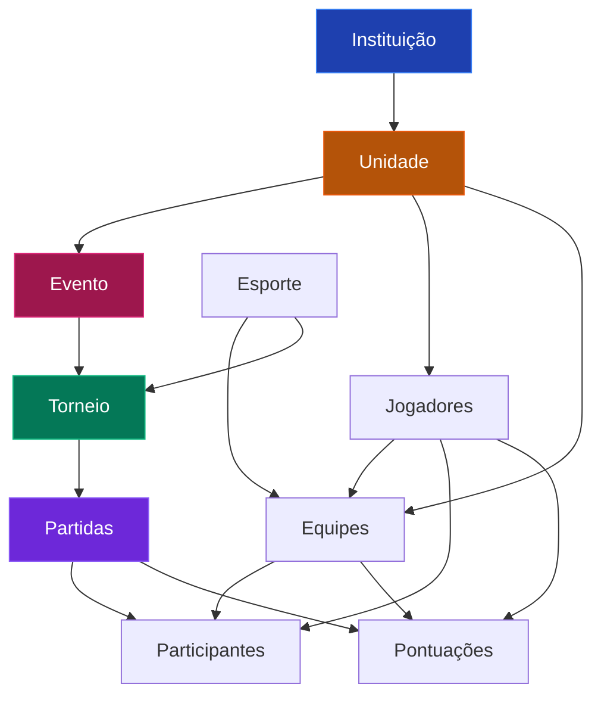
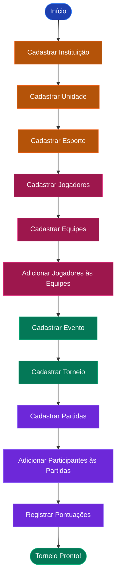

# Manual do Usuário - Gerenciador de Torneios

Bem-vindo ao **Gerenciador de Torneios**! Este manual irá guiá-lo passo a passo para realizar todas as manutenções necessárias na aplicação, desde o cadastro inicial até a realização completa de um torneio.

## 📋 Índice

1. [Introdução](#introdução)
2. [Acesso ao Sistema](#acesso-ao-sistema)
3. [Estrutura Hierárquica do Sistema](#estrutura-hierárquica-do-sistema)
4. [Fluxo Completo de Cadastro para um Torneio](#fluxo-completo-de-cadastro-para-um-torneio)
5. [Cadastros Básicos](#cadastros-básicos)
   - [5.1. Cadastrar Instituição](#51-cadastrar-instituição)
   - [5.2. Cadastrar Unidade](#52-cadastrar-unidade)
   - [5.3. Cadastrar Esporte](#53-cadastrar-esporte)
6. [Cadastros de Pessoas e Equipes](#cadastros-de-pessoas-e-equipes)
   - [6.1. Cadastrar Jogadores](#61-cadastrar-jogadores)
   - [6.2. Cadastrar Equipes](#62-cadastrar-equipes)
   - [6.3. Adicionar Jogadores às Equipes](#63-adicionar-jogadores-às-equipes)
7. [Cadastros de Eventos e Torneios](#cadastros-de-eventos-e-torneios)
   - [7.1. Cadastrar Evento](#71-cadastrar-evento)
   - [7.2. Cadastrar Torneio](#72-cadastrar-torneio)
8. [Gerenciamento de Partidas](#gerenciamento-de-partidas)
   - [8.1. Cadastrar Partida](#81-cadastrar-partida)
   - [8.2. Adicionar Participantes à Partida](#82-adicionar-participantes-à-partida)
   - [8.3. Registrar Pontuação da Partida](#83-registrar-pontuação-da-partida)
9. [Dicas e Boas Práticas](#dicas-e-boas-práticas)

---

## Introdução

O **Gerenciador de Torneios** é uma aplicação web desenvolvida para facilitar o gerenciamento completo de torneios esportivos. Com ela, você pode:

- Gerenciar instituições e suas unidades
- Cadastrar eventos esportivos
- Organizar torneios
- Controlar equipes e jogadores
- Registrar partidas e pontuações
- Acompanhar o andamento dos eventos

---

## Acesso ao Sistema

### Login

1. Acesse a página inicial do sistema
2. Informe seu **nome de usuário** e **senha**
3. Clique em **"Entrar"**

> 💡 **Nota:** Se você não possui credenciais, entre em contato com o administrador do sistema para criar sua conta.

---

## Estrutura Hierárquica do Sistema

Antes de começar os cadastros, é importante entender como os dados estão organizados no sistema. A estrutura segue uma hierarquia bem definida:



### Entendendo a Hierarquia

- **Instituição**: Representa uma organização (ex: Universidade, Clube, Escola)
- **Unidade**: Subdivisão da instituição (ex: Campus, Sede, Filial)
- **Evento**: Um evento esportivo organizado por uma unidade (ex: Jogos Internos 2025)
- **Esporte**: Modalidade esportiva (ex: Futebol, Vôlei, Basquete)
- **Torneio**: Competição de um esporte específico dentro de um evento
- **Equipe**: Grupo de jogadores de uma unidade para um esporte específico
- **Jogador**: Atleta cadastrado em uma unidade
- **Partida**: Confronto dentro de um torneio
- **Participante**: Equipe ou jogador que participa de uma partida
- **Pontuação**: Resultado registrado para um participante em uma partida

---

## Fluxo Completo de Cadastro para um Torneio

Para realizar um torneio completo, siga esta sequência lógica de cadastros:



> ⚠️ **Importante:** Respeite a ordem dos cadastros, pois cada etapa depende da anterior. Por exemplo, você não pode cadastrar uma unidade sem antes ter uma instituição cadastrada.

---

## Cadastros Básicos

### 5.1. Cadastrar Instituição

A instituição é o primeiro nível da hierarquia. Todas as outras entidades dependem dela.

#### Passo a Passo:

1. No menu lateral, clique em **"Instituições e Unidades"**
2. Na tabela de instituições, localize o botão **"Nova Instituição"** (geralmente no cabeçalho da tabela)
3. Preencha o formulário:
   - **Nome**: Digite o nome da instituição (ex: "Universidade Federal", "Clube Esportivo")
4. Clique em **"Salvar"** ou **"Criar"**

#### Visualizar e Editar:

- Para **editar** uma instituição existente, clique no botão de edição na linha correspondente
- Para **visualizar as unidades** de uma instituição, clique em **"Ver unidades"**

> 💡 **Dica:** Você pode cadastrar quantas instituições precisar. Cada instituição pode ter múltiplas unidades.

---

### 5.2. Cadastrar Unidade

As unidades são subdivisões de uma instituição. Elas são essenciais para organizar eventos, equipes e jogadores.

#### Passo a Passo:

1. No menu lateral, clique em **"Instituições e Unidades"**
2. Na tabela de instituições, clique em **"Ver unidades"** na instituição desejada
3. Na página de unidades, localize o botão **"Nova Unidade"** (geralmente no cabeçalho da tabela)
4. Preencha o formulário:
   - **Nome**: Digite o nome da unidade (ex: "Campus Central", "Sede Principal")
5. Clique em **"Salvar"** ou **"Criar"**

#### Visualizar e Editar:

- Para **editar** uma unidade existente, clique no botão de edição na linha correspondente
- Use o botão **"Voltar para Instituições"** para retornar à lista de instituições

> 💡 **Dica:** Uma unidade pode organizar múltiplos eventos e ter várias equipes e jogadores cadastrados.

---

### 5.3. Cadastrar Esporte

Os esportes são modalidades esportivas que podem ser utilizadas em torneios e equipes.

#### Passo a Passo:

1. No menu lateral, clique em **"Esportes"**
2. Na tabela de esportes, localize o botão **"Novo Esporte"** (geralmente no cabeçalho da tabela)
3. Preencha o formulário:
   - **Nome**: Digite o nome do esporte (ex: "Futebol", "Vôlei", "Basquete", "Futsal")
4. Clique em **"Salvar"** ou **"Criar"**

#### Visualizar e Editar:

- Para **editar** um esporte existente, clique no botão de edição na linha correspondente
- Para **excluir** um esporte, clique no botão de exclusão (⚠️ cuidado: isso pode afetar equipes e torneios vinculados)

> 💡 **Dica:** Cadastre todos os esportes que serão utilizados nos torneios antes de criar equipes e torneios.

---

## Cadastros de Pessoas e Equipes

### 6.1. Cadastrar Jogadores

Os jogadores são os atletas que participarão das equipes e partidas.

#### Passo a Passo:

1. No menu lateral, clique em **"Jogadores"**
2. No topo da página, você verá um campo de busca para selecionar a **Unidade**
   - Digite o nome da unidade ou selecione-a da lista
   - ⚠️ **Importante:** Você deve selecionar uma unidade antes de cadastrar jogadores
3. Após selecionar a unidade, o botão **"Novo Jogador"** aparecerá no cabeçalho da tabela
4. Clique em **"Novo Jogador"** e preencha o formulário:
   - **Nome**: Nome completo do jogador
   - **Email**: Email de contato (opcional, mas recomendado)
   - **Telefone**: Telefone de contato (opcional)
5. Clique em **"Salvar"** ou **"Criar"**

#### Visualizar e Editar:

- Para **editar** um jogador, clique no botão de edição na linha correspondente
- Para **excluir** um jogador, clique no botão de exclusão
- Os jogadores são filtrados por unidade, então certifique-se de selecionar a unidade correta para visualizar seus jogadores

> 💡 **Dica:** Mantenha os dados de contato atualizados para facilitar a comunicação com os atletas.

---

### 6.2. Cadastrar Equipes

As equipes são grupos de jogadores organizados por esporte e unidade.

#### Passo a Passo:

1. No menu lateral, clique em **"Equipes"**
2. No topo da página, você verá um campo de busca para selecionar a **Unidade**
   - Digite o nome da unidade ou selecione-a da lista
   - ⚠️ **Importante:** Você deve selecionar uma unidade antes de cadastrar equipes
3. Após selecionar a unidade, o botão **"Nova Equipe"** aparecerá no cabeçalho da tabela
4. Clique em **"Nova Equipe"** e preencha o formulário:
   - **Nome**: Nome da equipe (ex: "Time A", "Seleção de Futebol")
   - **Esporte**: Selecione o esporte da lista (você deve ter cadastrado o esporte anteriormente)
5. Clique em **"Salvar"** ou **"Criar"**

#### Visualizar e Editar:

- Para **editar** uma equipe, clique no botão de edição na linha correspondente
- Para **adicionar jogadores** à equipe, clique no botão específico para isso (ver seção 6.3)
- Para **excluir** uma equipe, clique no botão de exclusão

> 💡 **Dica:** Uma equipe pode ter múltiplos jogadores, mas cada equipe pertence a apenas um esporte e uma unidade.

---

### 6.3. Adicionar Jogadores às Equipes

Após criar equipes e jogadores, você precisa associar os jogadores às suas respectivas equipes.

#### Passo a Passo:

1. No menu lateral, clique em **"Equipes"**
2. Selecione a **Unidade** desejada
3. Na tabela de equipes, localize a equipe à qual deseja adicionar jogadores
4. Clique no botão **"Adicionar Jogador"** (ou similar) na linha da equipe
5. No formulário que abrir:
   - Selecione o **Jogador** da lista (apenas jogadores da mesma unidade aparecerão)
   - Preencha os **Detalhes** (opcional): informações adicionais sobre a participação do jogador na equipe
6. Clique em **"Salvar"** ou **"Adicionar"**

#### Gerenciar Jogadores da Equipe:

- Você pode adicionar múltiplos jogadores à mesma equipe
- Cada jogador pode fazer parte de múltiplas equipes (de esportes diferentes)

> 💡 **Dica:** Certifique-se de que os jogadores foram cadastrados na mesma unidade da equipe antes de tentar adicioná-los.

---

## Cadastros de Eventos e Torneios

### 7.1. Cadastrar Evento

Os eventos são ocasiões esportivas organizadas por uma unidade. Um evento pode conter múltiplos torneios.

#### Passo a Passo:

1. No menu lateral, clique em **"Eventos"**
2. No topo da página, você verá um campo de seleção para escolher a **Unidade**
   - Selecione a unidade que organizará o evento
   - ⚠️ **Importante:** Você deve selecionar uma unidade antes de cadastrar eventos
3. Após selecionar a unidade, o botão **"Novo Evento"** aparecerá no cabeçalho da tabela
4. Clique em **"Novo Evento"** e preencha o formulário:
   - **Nome**: Nome do evento (ex: "Jogos Internos 2025", "Copa de Inverno")
   - **Data de Início**: Data em que o evento começará
   - **Previsão de Término**: Data prevista para o fim do evento
5. Clique em **"Salvar"** ou **"Criar"**

#### Visualizar e Editar:

- Para **editar** um evento, clique no botão de edição na linha correspondente
- Para **excluir** um evento, clique no botão de exclusão (⚠️ cuidado: isso pode afetar torneios vinculados)
- Os eventos são filtrados por unidade

> 💡 **Dica:** Planeje bem as datas do evento, pois elas devem englobar todas as datas dos torneios que serão realizados dentro dele.

---

### 7.2. Cadastrar Torneio

Os torneios são competições específicas de um esporte dentro de um evento.

#### Passo a Passo:

1. No menu lateral, clique em **"Torneios"**
2. No topo da página, você verá um campo de seleção para escolher o **Evento**
   - Selecione o evento ao qual o torneio pertence
   - ⚠️ **Importante:** Você deve selecionar um evento antes de cadastrar torneios
3. Após selecionar o evento, o botão **"Novo Torneio"** aparecerá no cabeçalho da tabela
4. Clique em **"Novo Torneio"** e preencha o formulário:
   - **Nome**: Nome do torneio (ex: "Torneio de Futebol", "Copa de Vôlei")
   - **Esporte**: Selecione o esporte da lista
   - **Data de Início**: Data em que o torneio começará
   - **Previsão de Término**: Data prevista para o fim do torneio
5. Clique em **"Salvar"** ou **"Criar"**

#### Visualizar e Editar:

- Para **editar** um torneio, clique no botão de edição na linha correspondente
- Para **visualizar as partidas** de um torneio, clique em **"Ver partidas"**
- Para **excluir** um torneio, clique no botão de exclusão (⚠️ cuidado: isso pode afetar partidas vinculadas)
- Os torneios são filtrados por evento

> 💡 **Dica:** Certifique-se de que o esporte do torneio já foi cadastrado e que as datas do torneio estão dentro do período do evento.

---

## Gerenciamento de Partidas

### 8.1. Cadastrar Partida

As partidas são os confrontos que acontecem dentro de um torneio.

#### Passo a Passo:

1. No menu lateral, clique em **"Torneios"**
2. Selecione o **Evento** desejado
3. Na tabela de torneios, localize o torneio desejado e clique em **"Ver partidas"**
4. Na página de partidas, clique no botão **"Nova Partida"** (geralmente no cabeçalho da tabela)
5. Preencha o formulário:
   - **Data**: Data e hora da partida
   - **Local**: Local onde a partida será realizada (ex: "Ginásio Principal", "Campo 1")
   - **Rodada**: Número da rodada (ex: 1, 2, 3, ou "Quartas de Final", "Semifinal")
   - **Descrição**: Descrição adicional da partida (opcional)
   - **Ocorrências**: Observações sobre a partida (opcional)
6. Clique em **"Salvar"** ou **"Criar"**

#### Visualizar e Editar:

- Para **editar** uma partida, clique no botão de edição na linha correspondente
- O status da partida será exibido como **"Finalizada"** ou **"Não finalizada"**
- Uma partida só pode ser editada se o torneio não estiver finalizado

> 💡 **Dica:** Organize as partidas por rodadas para facilitar o acompanhamento do torneio.

---

### 8.2. Adicionar Participantes à Partida

Após criar uma partida, você precisa definir quais equipes ou jogadores participarão dela.

#### Passo a Passo:

1. Acesse a página de partidas do torneio (seguindo os passos da seção 8.1)
2. Na tabela de partidas, localize a partida desejada
3. Clique no botão **"Adicionar Participantes"** (ou similar) na linha da partida
4. No formulário que abrir:
   - **Tipo de Participante**: Selecione se é uma **Equipe** ou um **Jogador**
   - **Equipe/Jogador**: Selecione a equipe ou jogador da lista
     - Se escolher "Equipe", apenas equipes do mesmo esporte do torneio aparecerão
     - Se escolher "Jogador", apenas jogadores da mesma unidade aparecerão
5. Clique em **"Salvar"** ou **"Adicionar"**

#### Gerenciar Participantes:

- Você pode adicionar múltiplos participantes a uma partida
- Uma partida pode ter equipes ou jogadores individuais, dependendo do tipo de competição
- Certifique-se de adicionar todos os participantes antes de registrar as pontuações

> 💡 **Dica:** Para partidas em dupla ou equipe, adicione todos os participantes antes de começar a registrar pontuações.

---

### 8.3. Registrar Pontuação da Partida

Após adicionar os participantes e realizar a partida, você deve registrar as pontuações.

#### Passo a Passo:

1. Acesse a página de partidas do torneio
2. Na tabela de partidas, localize a partida desejada
3. Clique no botão **"Registrar Pontuação"** (ou similar) na linha da partida
4. No formulário que abrir:
   - **Participante**: Selecione o participante (equipe ou jogador) que receberá a pontuação
   - **Pontuação**: Digite a pontuação obtida (número inteiro)
   - **Detalhes**: Informações adicionais sobre a pontuação (opcional)
5. Clique em **"Salvar"** ou **"Registrar"**

#### Gerenciar Pontuações:

- Registre a pontuação de cada participante da partida
- Você pode editar pontuações caso necessário
- Após registrar todas as pontuações, você pode marcar a partida como finalizada

> 💡 **Dica:** Mantenha um registro cuidadoso das pontuações para garantir a precisão dos resultados do torneio.

---

## Dicas e Boas Práticas

### Organização e Planejamento

1. **Planeje antes de cadastrar**: Antes de começar, tenha em mente:
   - Quantas instituições e unidades você precisa
   - Quais esportes serão utilizados
   - Quantos eventos e torneios serão realizados
   - Quantos jogadores e equipes participarão

2. **Siga a hierarquia**: Sempre respeite a ordem de cadastro:
   ```
   Instituição → Unidade → Esporte → Jogadores/Equipes → Evento → Torneio → Partidas
   ```

3. **Mantenha dados atualizados**: Revise periodicamente os cadastros para garantir que as informações estão corretas.

### Nomenclatura Consistente

- Use nomes claros e descritivos para instituições, unidades e eventos
- Padronize os nomes das equipes (ex: sempre usar "Time A" ou sempre usar "Equipe 1")
- Mantenha consistência nas descrições de partidas e rodadas

### Validações Importantes

- ⚠️ **Datas**: Certifique-se de que as datas dos torneios estão dentro do período do evento
- ⚠️ **Esportes**: Verifique se o esporte da equipe corresponde ao esporte do torneio antes de adicionar participantes
- ⚠️ **Unidades**: Jogadores e equipes devem pertencer à mesma unidade do evento

### Fluxo de Trabalho Recomendado


### Solução de Problemas Comuns

**Problema:** Não consigo cadastrar uma unidade
- **Solução:** Verifique se você já cadastrou uma instituição primeiro

**Problema:** Não aparecem jogadores ao tentar adicionar à equipe
- **Solução:** Certifique-se de que os jogadores foram cadastrados na mesma unidade da equipe

**Problema:** Não consigo criar um torneio
- **Solução:** Verifique se você selecionou um evento e se o esporte já foi cadastrado

**Problema:** Não aparecem equipes ao adicionar participantes à partida
- **Solução:** Verifique se as equipes pertencem ao mesmo esporte do torneio

### Acesso e Permissões

- **Usuários Administradores**: Têm acesso a todas as funcionalidades, incluindo gerenciamento de usuários e logs
- **Usuários Comuns**: Podem gerenciar eventos, torneios, partidas, equipes e jogadores relacionados aos eventos aos quais têm acesso

---

## Conclusão

Parabéns! Agora você está preparado para realizar todas as manutenções necessárias no **Gerenciador de Torneios**. 

Lembre-se:
- ✅ Siga a hierarquia de cadastros
- ✅ Mantenha os dados organizados e atualizados
- ✅ Planeje antes de executar
- ✅ Revise periodicamente as informações

Se tiver dúvidas ou encontrar problemas, consulte este manual ou entre em contato com o suporte técnico.

**Boa sorte com seus torneios! 🏆**
