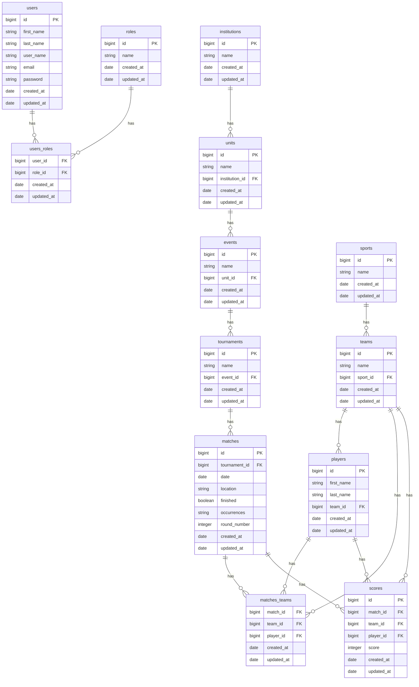

## Admin endpoints

- `GET /auth/login`: Login to the admin panel
- CRUD Institutions
- CRUD Units
- CRUD Events
- CRUD Tournaments
- CRUD Sports
- CRUD Teams*
- CRUD Players*
- CRUD Matches*
- CRUD Scores*

\* Available for `manager` users

## Webpage endpoints (open access)

- `GET /events`: List all events
- `GET /events/:id/tournaments`: List all tournaments for an event
- `GET /sports`: List all sports
- `GET /sprots/:id/teams`: List all teams of a sport
- `GET /teams/:id/players`: List all players of a team
- `GET /matches`: List all matches
- `GET /tournaments/:id/matches`: List all matches of a tournament
- `GET /matches/:id`: Show the defails of a match with scores 

## ER Diagram

